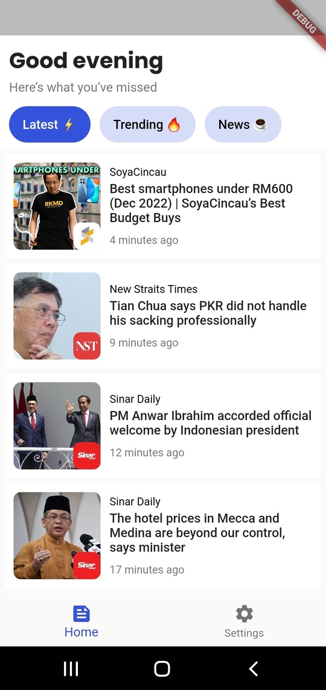
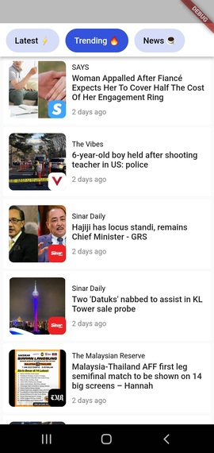
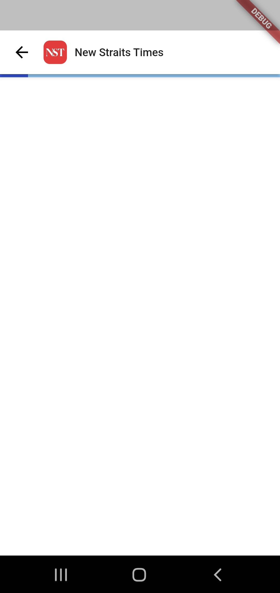
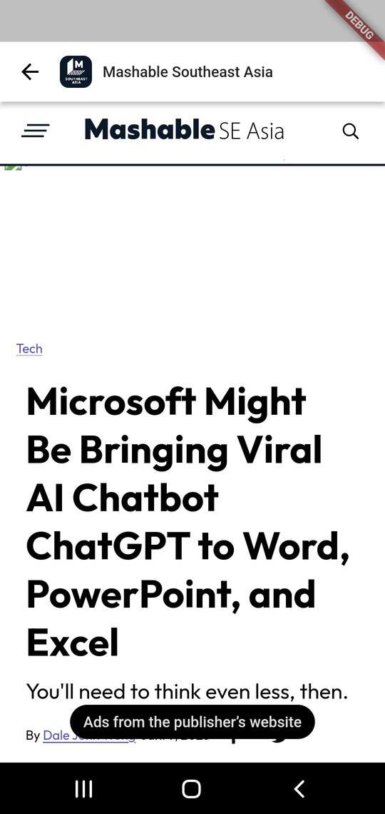
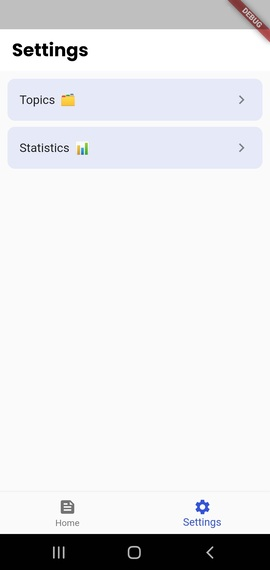
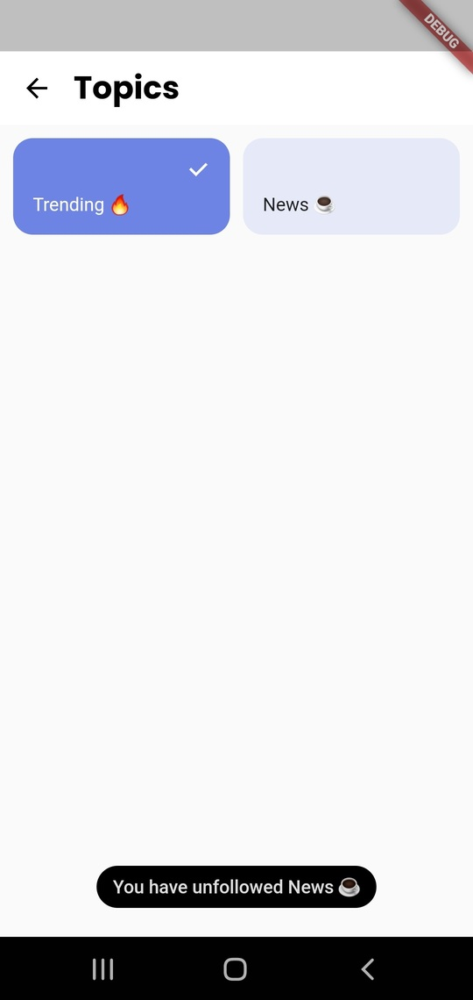

# Lumi Lite

**_News from your favourite sites,all in one app. It's the only one news app you need._**

Able to complete all the app requirements including bonus points within just 7 days of working. I also created an app icon for this particular app just to make it looks more interesting. There are some bugs I discovered along the way but due to the deadline, I just fix them as much as I could. Before I forgot, I has uploaded the apk file on Github for you to download in case you don't want to be bothered with debugging.

## Getting Started

Here are several packages that I use in this project:

- [provider](https://pub.dev/packages/provider)
- [csv](https://pub.dev/packages/csv)
- [cached_network_image](https://pub.dev/cached_network_image)
- [webview_flutter](https://pub.dev/packages/webview_flutter)

Since this app is basically a lite version of Lumi App, so I tried to use less dependencies in order to reduce the app size. For the state management, I use Provider instead of Riverpod because I'm not really familiar with Riverpod but if I have some free time, I will probably try to learn it in the future. Usually I use [shared_preferences](https://pub.dev/packages/shared_preferences) to persist the data locally but for this project, I didn't use it because it will take more line of codes to write and it is also not one of the requirements. Hope you guys understand. :smile:

### Home Page

Some desc

### News Page

Some desc

### Settings Page

Some desc