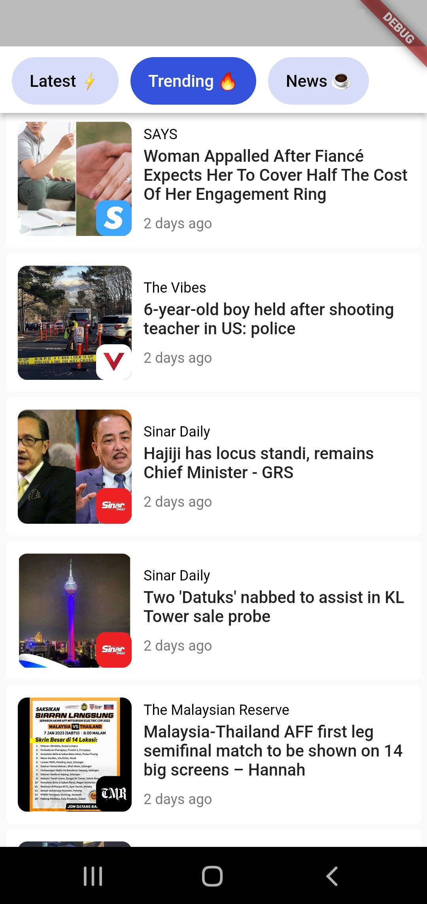
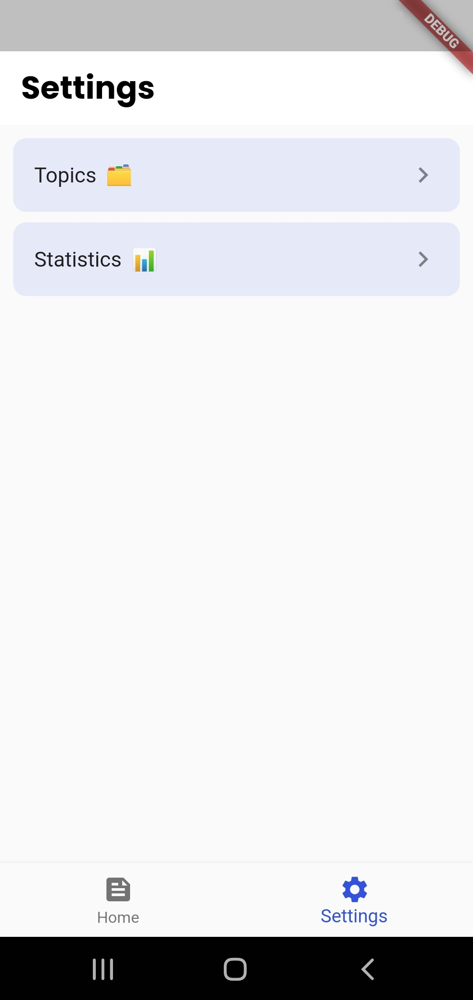

# Lumi Lite

**_News from your favourite sites,all in one app. It's the only one news app you need._**

Able to complete all the app requirements including bonus points within just 7 days of working. I also created an app icon for this particular app just to make it looks more interesting. There are some bugs I discovered along the way but due to the deadline, I just fix them as much as I could. Before I forgot, I has uploaded the apk file on Github for you to download in case you don't want to be bothered with debugging.

## Getting Started

Here are several packages that I use in this project:

- [provider](https://pub.dev/packages/provider)
- [csv](https://pub.dev/packages/csv)
- [cached_network_image](https://pub.dev/cached_network_image)
- [webview_flutter](https://pub.dev/packages/webview_flutter)

Since this app is basically a lite version of Lumi App, so I tried to use less dependencies in order to reduce the app size. For the state management, I use Provider instead of Riverpod because I'm not really familiar with Riverpod but if I have some free time, I will probably try to learn it in the future. Usually I use [shared_preferences](https://pub.dev/packages/shared_preferences) to persist the data locally but for this project, I didn't use it because it will take more line of codes to write and it is also not one of the requirements. Hope you guys understand. :smile:

### Home Page

 

Upon opening the app, the users will be greeted accordingly based on their local time zone. It would be cool if there are some background animations behind the greetings widget to show the weathers based on their location. When the user scroll down to see the list of news, the app bar and the bottom navigation bar will hide automatically. Users also can view any categories they want by swiping horizontally or clicking on the tabs below the greetings widget.

### News Page

 

Users will be able to see the loading indicator during the news loading. Snackbars will be shown to notify users regarding the ads and their milestones. In the background, a timer will start to record the amount of the user's reading time. Their total reading time will be accumulated and be shown on the statistics page.

### Settings Page

  

There are two sections inside the settings page: topics and statistics. For topics, users can follow/unfollow any topics they want. I have applied an animation on the buttons on this page, where they will 'pop' a little when users click them. Inside the statistics page, users will be able to see a variety of statistics such as the recently viewed article, the top 3 publishers, the most read category and also their total reading time as I mentioned before. There are a lot more statistics I want to add here but due to time constraint, I just put as much as I could. I know the UI of this page is ugly, but don't judge.